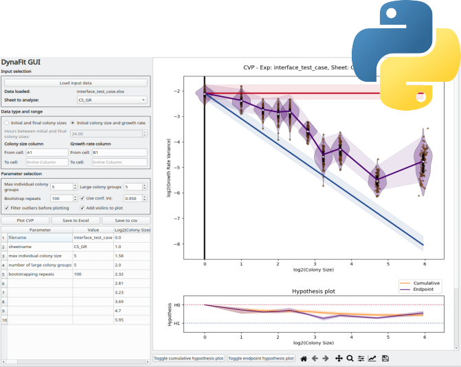

# DynaFit

    

This repository contains the source code for the DynaFit application, published in the article [Cancer Cell Fitness is Dynamic](https://aacrjournals.org/cancerres/article/81/4/1040/650203/Cancer-Cell-Fitness-Is-DynamicCancer-Cell-Fitness) (*Cancer Research, 2021*).

You can read more about DynaFit, and download the DynaFit executable, from LabSinal's website [here](http://www.ufrgs.br/labsinal/dynafit/index.html).

## Citation
If you use DynaFit, please cite:

Luana S. Lenz, Juliano L. Faccioni, Paula A. Bracco, Jephesson A.F. Santos, Luiza C. Pereira, Julieti H. Buss, Mauricio T. Tamborindeguy, Daphne Torgo, Thayana Monteiro, Giovana B. Mantovani, Carolina N. Santo, Julia C. Marcolin, Eloisa Dalsin, Alvaro Vigo, Sidia M. Callegari-Jacques, Andrew O. Silva, Giovana R. Onzi, Karine R. Begnini, Guido Lenz; Cancer Cell Fitness Is Dynamic. Cancer Res 15 February 2021; 81 (4): 1040–1051. https://doi.org/10.1158/0008-5472.CAN-20-2488
